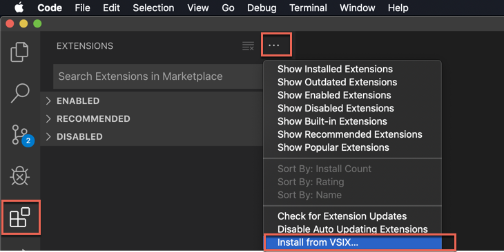
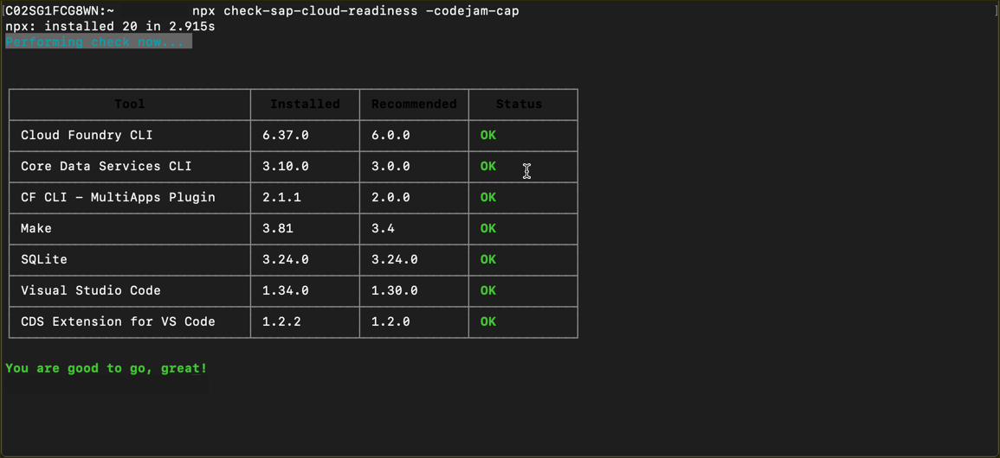

# Exercise 01 - Installing the CAP related tools

In this exercise you'll install all the tools required to work comfortably with the Node.js flavor of CAP in a local environment.

Successfully completing this exercise relies on the hardware and software [prerequisites](../../prerequisites.md) published for this CodeJam. These prerequisites describe the requirement for some software preinstalled; this includes VS Code and Node.js. This exercise will focus on tools relating to both of these. (If you haven't already installed Node.js, we recommend version 10 (LTS)).

## Steps

After completing these steps you'll have a working local environment for development of CAP based projects with Node.js.

### 1. Install the CDS command line tool

The CDS command line tool is the heart of everything you do when developing CAP services locally. It is Node.js based and comes in the form of an NPM package (which further depends on other packages). The package and its dependencies are in the `@sap` namespace and are available from the [SAP NPM registry](https://blogs.sap.com/2017/05/16/sap-npm-registry-launched-making-the-lives-of-node.js-developers-easier/).

:point_right: First, relate the `@sap` namespace to the SAP NPM registry:

```shell
user@host:~
=> npm set @sap:registry=https://npm.sap.com
```

:point_right: Check that this setting is now saved in your configuration, with:

```sh
user@host:~
=> npm config ls
```

You should see output similar to this:

```sh
; cli configs
metrics-registry = "https://registry.npmjs.org/"
scope = ""
user-agent = "npm/6.4.1 node/v10.15.3 linux x64"

; userconfig /user/.npmrc
@sap:registry = "https://npm.sap.com"

; node bin location = /user/.nvm/versions/node/v10.15.3/bin/node
; cwd = /
; HOME = /user
; "npm config ls -l" to show all defaults.
```

:point_right: Next, explore the information about the `@sap/cds` package, including its dependencies, with:

```sh
user@host:~
=> npm info @sap/cds
```

This will show you that it has dependencies on other `@sap` namespaced packages, and also that there is a 'binary' (in other words an executable) called `cds` that's delivered as part of the package.

:point_right: Now, install the `@sap/cds` package globally:

```sh
user@host:~
=> npm install --global @sap/cds
```

This should eventually produce output similar to this:

```sh
/Users/i347491/.nvm/versions/node/v10.16.3/bin/cds -> /Users/i347491/.nvm/versions/node/v10.16.3/lib/node_modules/@sap/cds/bin/cds.js
+ @sap/cds@3.18.3
added 69 packages from 144 contributors in 6.416s
```

Here you can see that the version of the `@sap/cds` package installed is 3.18.3. It may be that the version of `@sap/cds` that is installed when you do this exercise will be different (newer).

### 2. Install the CDS extension for VS Code

To efficiently and comfortably develop CAP based services with CDS, there is an extension for the [VS Code](https://code.visualstudio.com/) IDE. This is available to download from the [SAP Development Tools](https://tools.hana.ondemand.com/) website.

Extensions can be installed directly in VS Code from the extension marketplace, or manually from a file. In this case the extension for CDS language support is available in the form of a file.

:point_right: Go to the [Cloud section of the SAP Development Tools website](https://tools.hana.ondemand.com/#cloud) and find the "CDS Language Support for Visual Studio Code" section. Follow the instructions there to download and subsequently install the extension.

To install the downloaded extension in VS Code have a look at the screenshot below: 



When successfully installed, you should see the extension thus (again, the version number may be different):


> **For macOS users only:** To be able to open VS Code from the command line (which you will be doing in a subsequent exercise) you need to add the installation path of VS Code to the environment variable PATH. There's an option to do this via the `Command Palette` in VS Code. 

> Open the `Command Palette` with ⇧⌘P. You can also open it via the menu bar: View -> Command Palette.

> 

> Search for `code` and press Enter. 

> 

> A success message for the process should then appear at the bottom right of the screen. 

> 

### 3. Verify your development environment

:point_right: Run the following command from the terminal to check whether all required tools are installed (this is an experimental tool, please contact the instructor if you have any questions):

```shell
npx check-sap-cloud-readiness -codejam-cap
```

You should see an output similar to this:


If necessary, double check the [prerequisites](../prerequisites.md) to install the missing tools. Please contact the instructor of this CodeJam if you need help.


## Summary

You've now installed the key tools for developing with CAP locally, and are all set to create your first project.

## Questions

1. What are the benefits of using NPM here?

1. What are the `@sap` namespaced packages upon which `@sap/cds` depends?

1. What is the significance of using the `--global` option when installing the `@sap/cds` package?

1. What is the meaning of the `.vsix` file type for the VS Code extension? Can we dig into that to see what's inside?
