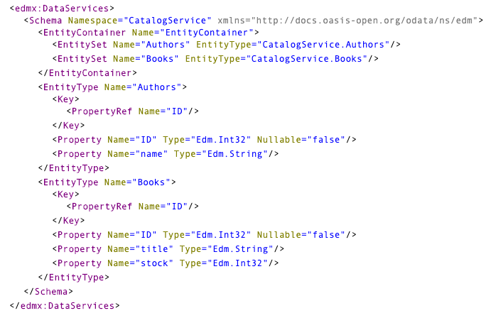
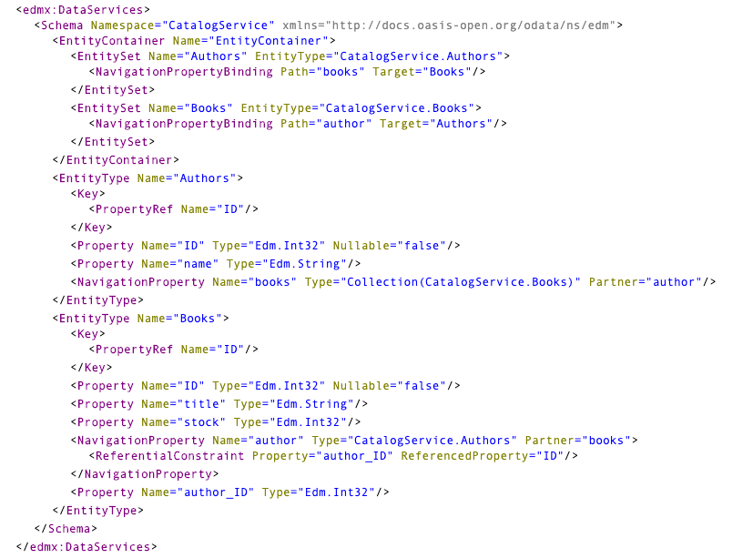

# Exercise 03 - Enhancing the project & adding persistence

In this exercise you'll enhance your basic bookshop project by adding to the data model and service definition, and creating a persistence layer.


## Steps

After completing these steps you'll have a slightly more complex OData service, with a second entity that is related to the first. It will also be backed by an actual persistence layer, provided by SQLite.

### 1. Use `cds watch` to have the service restart on changes

During the course of this CodeJam you'll be making many changes and additions to CDS and JavaScript sources. Rather than restart the service manually each time, you can use the `watch` command with the `cds` command line tool, that will restart the server on file changes.

:point_right: Do this now, by entering `cds watch` in the integrated terminal (if you still have the service running, terminate it first with Ctrl-C):

```sh
user@host:~/bookshop
=> cds watch
```

The `watch` command uses the NPM [nodemon](https://www.npmjs.com/package/nodemon) package, which you can see from the output that it produces, which should look something like this:

```
[cds] - running nodemon...
--exec cds run --with-mocks --in-memory?
--ext cds,csn,csv,ts,mjs,cjs,js,json,properties,edmx,xml

[cds] - connect to datasource - hana:undefined
[cds] - serving CatalogService at /catalog
[cds] - launched in: 555.266ms
[cds] - server listening on http://localhost:4004 ...
[ terminate with ^C ]
```

You can now proceed with saving changes to your project and have the service automatically restarted. Nice!

### 2. Add a new Authors entity to the model

Currently the data model is extremely simple. In this step you'll add a second entity `Authors`.

:point_right: Open the `db/schema.cds` file in VS Code and add a new entity definition, after the `Books` entity, thus:

```cds
entity Authors {
  key ID : Integer;
  name   : String;
}
```

This is deliberately very simple at this point. Don't forget to save the file ... at which point your service should restart automatically thanks to `cds watch`.

:point_right: Open up (or refresh) the [service metadata document](http://localhost:4004/catalog/$metadata) and check for the Authors entity definition you've just added.

You're right. It's not there.


### 3. Expose the Authors entity in the service

While there is now a second entity definition in the data model, it is not exposed in the existing service. In this step, you'll remedy that.

:point_right: Open up the `srv/service.cds` file and add a second entity to the `CatalogService` definition.

This is what the contents of `srv/service.cds` should look like after you've added the new entity and removed the annotation:

```cds
using my.bookshop as my from '../db/schema';

service CatalogService {
    entity Books as projection on my.Books;
    entity Authors as projection on my.Authors;
}
```

:point_right: After the service restarts, check the metadata document once again. The definition of the Authors entity should now be present in the metadata, and will look something like this:



This is nice, but there's something fundamental that's missing and preventing this data model from being useful.


### 4. Add a relationship between the Books and Authors entities

The `Books` and `Authors` entities are standalone and currently are not related to each other. This is not ideal, so in this step you'll fix that by adding a relationship in the form of an [association](https://cap.cloud.sap/docs/cds/cdl#associations).

:point_right: Return to the `db/schema.cds` file and add an association from the `Books` entity to the `Authors` entity, bearing in mind the simplified assumption that a book has a single author. The association should describe a new `author` property in the `Books` entity like this:

```cds
entity Books {
  key ID : Integer;
  title  : String;
  stock  : Integer;
  author : Association to Authors;
}
```

Note that as you type, the CDS Language Services extension for VS Code that you installed in [exercise 01](../01/) provides very useful command completion, recognising the entities defined as well as the CDS syntax itself:


This `Association to Authors` relationship will allow a consumer to navigate from a book to the related author, but not from an author to their books. Let's fix that now by adding a second association.

:point_right: To the `Authors` entity, add a `books` property thus:

```cds
entity Authors {
  key ID : Integer;
  name   : String;
  books  : Association to many Books on books.author = $self;
}
```

Note that this is a 'to-many' relationship.

Don't forget to save the file.

:point_right: After the service has restarted, check the [metadata document](http://localhost:4004/catalog/$metadata) again. There should now be OData navigation properties defined between the two entities, like this:




### 5. Deploy the service to a persistence layer

As it stands, the OData service has no storage. We can actually simulate storage with [service provider](https://cap.cloud.sap/docs/guides/service-impl) logic in JavaScript but that's not a path we want to explore right now (we'll look at it in [exercise 08](../08/)). Instead, we'll use a real database in the form of [SQLite](https://sqlite.org) and deploy the data model and service definition to it.

As we want to use a local SQLite database (SQLite was defined in the [prerequisites](../../prerequisites.md) for this CodeJam), we need to install a client library to allow the CAP engine to communicate with this DB.

:point_right: Do that now, i.e. install the `sqlite3` package for this purpose:
```
user@host:~/bookshop
=> npm install -D sqlite3
```

> The use of the `-D` (or `--save-dev`) parameter signifies that the `sqlite3` package is a dependency for development purposes only. Have a look at what gets added to `package.json` at this point to see the two different types of package dependencies.

Now it's time to make that deployment to the persistence layer.

:point_right: Explore the `cds deploy` command like this:

```sh
user@host:~/bookshop
=> cds deploy --help

SYNOPSIS

    cds deploy [ <model> ] [ --to <database> ]

    Deploys the given model to a database. If no model is given it looks up
    according configuration from package.json or .cdsrc.json in key
    cds.requires.db.  Same for the database.

    Supported databases: sqlite, hana

    [...]
```

Use this command to deploy the data model and service definition to a new SQLite-based database (databases with SQLite are simply files on the local filesystem).

:point_right: Deploy to a new SQLite database like this (remember, you need to be inside the `bookshop` project directory when you invoke this):

```
user@host:~/bookshop
=> cds deploy --to sqlite:bookshop
```

This should complete fairly quietly, something like this:

```
/> successfully deployed to ./bookshop.db
 > updated ./package.json
```

### 6. Explore the new database

At this point you should have a new file `bookshop.db` in the project folder.

:point_right: Have a look inside it with the `sqlite3` command line utility; use the `.tables` command to see what has been created:

```sh
user@host:~/bookshop
=> sqlite3 bookshop.db
SQLite version 3.22.0 2018-01-22 18:45:57
Enter ".help" for usage hints.
sqlite> .tables
CatalogService_Authors  my_bookshop_Authors
CatalogService_Books    my_bookshop_Books
sqlite> .quit
user@host:~/bookshop
```

> The `sqlite3` command line utility is not directly related to the `sqlite3` NPM package you just installed; it came from the installation of SQLite itself.


### 7. Dig into the link between the CDS definitions and the artefacts in the database

Looking at the tables in the `bookshop.db` database we see that there are two pairs of names; one pair prefixed with `CatalogService` and the other pair prefixed with `my_bookshop`. If you guessed that the `CatalogService`-prefixed artefacts relate to the service definition and the `my_bookshop`-prefixed artefacts relate to the data model, you are correct.

In this step you'll look briefly at what these artefacts are and how they are created.

The `cds compile` command turns CDS definitions into different target outputs. In the case of our project based on SQLite, this output needs to be in the form of Data Definition Language (DDL) commands.

When running the `cds deploy` command, this compilation is done as part of the process. But you can also see it explicitly.

:point_right: Do that now, first for the data definitions, with:

```sh
user@host:~/bookshop
=> cds compile db --to sql
```

This will produce SQL data definition language commands like this:

```sql
CREATE TABLE my_bookshop_Authors (
  ID INTEGER,
  name NVARCHAR(5000),
  PRIMARY KEY(ID)
);

CREATE TABLE my_bookshop_Books (
  ID INTEGER,
  title NVARCHAR(5000),
  stock INTEGER,
  author_ID INTEGER,
  PRIMARY KEY(ID)
);
```

:point_right: Now try it for the service definition:

```sh
user@host:~/bookshop
=> cds compile srv --to sql
```

You should see output like this:

```sql
CREATE TABLE my_bookshop_Authors (
  ID INTEGER,
  name NVARCHAR(5000),
  PRIMARY KEY(ID)
);

CREATE TABLE my_bookshop_Books (
  ID INTEGER,
  title NVARCHAR(5000),
  stock INTEGER,
  author_ID INTEGER,
  PRIMARY KEY(ID)
);

CREATE VIEW CatalogService_Authors AS SELECT
  "AUTHORS_$0".ID,
  "AUTHORS_$0".name
FROM my_bookshop_Authors AS "AUTHORS_$0";

CREATE VIEW CatalogService_Books AS SELECT
  "BOOKS_$0".ID,
  "BOOKS_$0".title,
  "BOOKS_$0".stock,
  "BOOKS_$0".author_ID
FROM my_bookshop_Books AS "BOOKS_$0";
```

Observe that compiling the service definition will automatically produce DDL for the entities in the data model too, as the service refers to them. Observe also that the service artefacts are views, whereas the data model artefacts are tables.


## Summary

You now have a fully functional, albeit simple, OData service backed by a persistence layer, where the data is stored in a local SQLite database file.


## Questions

1. What are other possible targets in the compilation context?
<!--- yaml, edmx, when inspecting cdsc you can find hana,odata,cds,swager,sql,csn as well --->

2. What is the thinking behind the use of views at the service definition layer and tables at the data model layer?
<!--- different consumers on the same data (APIs, UIs), leverage features of a view, separation of concerns,  --->

3. Why might you use the `cds compile` command at all?
<!--- to understand what happens under the hood when you run cds deploy --->
