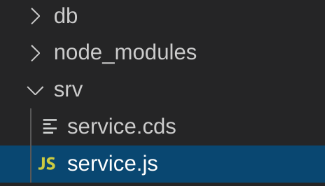
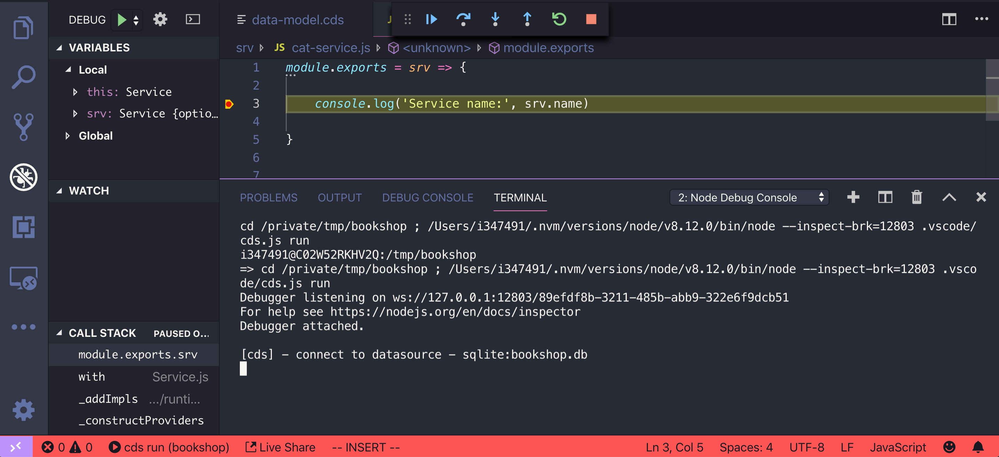
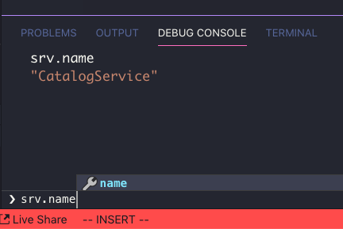

# Exercise 08 - Adding custom logic, and debugging

In this exercise you'll learn how to add custom processing of specific OData operations on your services. It's done by adding [custom implementation logic](https://help.sap.com/viewer/65de2977205c403bbc107264b8eccf4b/Cloud/en-US/68af515a26d944c38d81fd92ad33681e.html) (in JavaScript) via well-defined hooks into the service API.

Along the way you'll also learn how to use debugging features in VS Code, with the [launch configuration](https://code.visualstudio.com/docs/editor/debugging#_launch-configurations) provided by the `cds init` command that you used in an earlier exercise.

With custom implementation logic you can turn an out-of-the-box service into more or less whatever you need, in a clean and minimal way.


## Steps

At the end of these steps you will have modified the `CatalogService` service in such a way that books with a high stock value will be discounted (and for the sake of simplicity with this simple data model, the discount will be shown in the book's title).


### 1. Create the outline of a custom logic handler

Custom logic for a given service definition is provided in a JavaScript file that shares the same base name as that service definition file. For example, for a service definition file `my-service.cds` the custom logic should be placed in `my-service.js`.

This custom logic file is normally placed in the same directory as the service definition file (i.e. side-by-side with it).

:point_right: Create a new file `cat-service.js` in the `srv/` directory. You should end up with something like this:




### 2. Add some basic custom logic code

:point_right: In the new file `cat-service.js`, add the following code:

```javascript
module.exports = srv => {

  console.log('Service name:', srv.name)

}
```

You can see that this custom logic handler file is in the form of a module, which exports a single function. That function (defined using [ES6 arrow functions](https://developer.mozilla.org/en-US/docs/Web/JavaScript/Reference/Functions/Arrow_functions)) has a single parameter `srv` to receive the server object on invocation.


### 3. Run the service

:point_right: In the same way you've started the service in previous exercises, simply start the service now:

```sh
user@host:~/bookshop
=> cds serve all
```

You should see a few interesting lines in the output, highlighted here:

```
user@host:~/bookshop
=> cds serve all

[cds] - connect to datasource - sqlite:bookshop.db
Service name: CatalogService
Service name: Stats
[cds] - serving CatalogService at /catalog - impl: cat-service.js
[cds] - serving Stats at /stats - impl: cat-service.js
[cds] - service definitions loaded from:

  srv/cat-service.cds
  db/data-model.cds
  node_modules/@sap/cds/common.cds

[cds] - server listens at http://localhost:4004 ... (terminate with ^C)
[cds] - launched in: 1125.468ms
```

The first two ("serving \<service\> at \<endpoint\> ...") that we've seen before now have extra information showing that there's a JavaScript implementation that complements the service definition.

Note that as the relationship between the service definition and the handler is at file level, the new `cat-service.js` file is deemed a handler for both services (`CatalogService` and `Stats`) in that service definition file.

In fact, we can see that two lines from the call to `console.log` confirm that - the function defined in the module is called twice - once for each service (the first time `srv.name` is "CatalogService", and the second time it's "Stats").


### 4. Set a breakpoint and launch in debug mode

The project already comes with some configuration that works with VS Code for debugging - if you're curious, have a look in the `.vscode/` directory in the root of the project.

It means that you can easily set a breakpoint and launch the service in debug mode using standard VS Code features.

:point_right: Before proceeding with the main part of this step, make sure the service is not running - go to the integrated terminal and stop it with Ctrl-C.

:point_right: Now, set a breakpoint on the `console.log` line you added in the custom logic handler, by clicking in the margin to the left of the line numbers (or hitting F9 when on the line), to set a red mark as shown:


:point_right: Start the service in debug mode by using menu option "Debug -> Start Debugging", or simply hit F5. VS Code should switch to the debug perspective on the left hand side, and the service should start running, pausing at the `console.log` line as shown:



At this point you can explore a little bit.

:point_right: Switch to the Debug Console (next to the integrated terminal) and examine the `srv` object, which reflects a rich API. Try examining the values of the following, by typing them into the Debug Console input area.



```javascript
srv.name
```

```javascript
Object.keys(srv.entities)
```

```javascript
srv.path
```

:point_right: Use the debug control buttons to continue:


:point_right: When you've finished exploring, switch back to the integrated terminal and terminate the service.


### 5. Add custom logic

At this point we're confident enough to start adding custom logic, by [registering custom handlers](https://help.sap.com/viewer/65de2977205c403bbc107264b8eccf4b/Cloud/en-US/94c7b69cc4584a1a9dfd9cb2da295d5e.html). The custom logic should cause a discount message ("5% off!") to appear with the titles of books that are highly stocked (and therefore are those which we want to discount in order to get rid of). 

:point_right: Add the following code directly after the call to `console.log` in the `cat-service.js` file. As you do, notice in the code the comments that the custom logic is implemented in two different ways, using two different programming styles - you only need one of them. Comment out (or delete) one of them, leaving the one you prefer:

```js
  if (srv.name === 'CatalogService') {

    srv.after ('READ', 'Books', xs => {

      // CHOOSE ONLY ONE OF THESE ...
      // AND LET US KNOW YOUR PREFERENCE AND WHY! :-)

      // option 1 start
      xs.map(x => x.stock > 500 && (x.title = `(5% off!) ${x.title}`))
      // option 1 end

      // option 2 start
      let newBooks = [];
      xs.forEach(x => {
        if (x.stock > 500) {
          x.title = '(5% off!) ' + x.title
        }
        newBooks.push(x)
      })
      return newBooks
      // option 2 end

    })

  }
```


:point_right: Restart the service (you can choose to do it normally or in debug mode so you can explore with breakpoints in this code) and check that the [titles for certain books](http://localhost:4004/catalog/Books) have been modified to show a discount, like this:


## Summary

You have added custom logic and learned how to debug a service in VS Code. The options available for adding custom logic are rich and plentiful - we recommend you look further into the [documentation](https://help.sap.com/viewer/65de2977205c403bbc107264b8eccf4b/Cloud/en-US/94c7b69cc4584a1a9dfd9cb2da295d5e.html) for more information.


## Questions

1. What other hooks do you think might be useful in customizing a service?

1. What is the command used in the launch configuration for starting the service in debug mode - is it `cds serve all`?

1. How many times is the function (that is supplied to the `after` hook) called?
