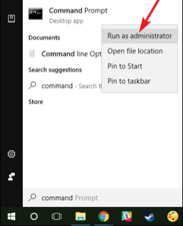

# Prerequisites

There are hardware and software prerequisites for participating in this CodeJam. There are also some optional, recommended items that you might like to have too. **Administration rights are an essential requirement due to the installation of some local tools**. 

## Hardware

Each participant should have their own laptop with enough admin privileges to be able to install software. You should also be able to access a command line shell (e.g. `cmd.exe` on Windows). The laptop should also be able to connect to the host organization's guest network for Internet access, and have enough power for the whole day.

## SAP Cloud Platform

Each attendee must have an SAP Cloud Platform trial account, and specifically a Cloud Foundry environment with an organization and a space defined. See the following tutorials for more details:

- [Get a Free Trial Account on SAP Cloud Platform](https://developers.sap.com/tutorials/hcp-create-trial-account.html)
- [Log in via the Cloud Foundry Command Line Interface](https://developers.sap.com/tutorials/cp-cf-download-cli.html)

## Software

There are some mandatory and optional requirements with respect to software. The installation instructions are dependent on the operating system. Please ensure you follow instructions according to your operating system in the subsections below, to have the mandatory software installed on your laptops **before** the day of the CodeJam.

### Windows - Mandatory

Some of these mandatory software requirements are to be installed manually (directly), others via the [Chocolatey](https://chocolatey.org/) package manager.

First, install the following tools manually:

- Chrome (latest version): <https://www.google.com/chrome/>
- Visual Studio Code (also known as VS Code): <https://code.visualstudio.com/download>
- Postman : <https://www.getpostman.com/downloads/>

Next, install Chocolatey. Therefore open a command prompt as an **administrator**. 



Execute the following command in this recently opened command prompt to install Chocolatey:

  ```bash
  @"%SystemRoot%\System32\WindowsPowerShell\v1.0\powershell.exe" -NoProfile -InputFormat None -ExecutionPolicy Bypass -Command "iex ((New-Object System.Net.WebClient).DownloadString('https://chocolatey.org/install.ps1'))" && SET "PATH=%PATH%;%ALLUSERSPROFILE%\chocolatey\bin"
  ```


Use Chocolatey to install Node.js Long Term Support (LTS) version, SQLite, make, curl (command-line client for URLs), jq (lightweight and flexible command-line JSON processor), Cloud Foundry command line interface (CLI) and the Microsoft Build Tools:
```bash
choco install -y nodejs-lts make curl jq cloudfoundry-cli microsoft-build-tools
```
  
Next, use the Cloud Foundry CLI to install a plugin to deploy your MultiTarget Application (MTA) to Cloud Foundry:
  ```bash
  cf install-plugin multiapps
  ```
  
Once you're done installing, please ensure you can successfully start the executables `sqlite3`, `make`, `cf` and `node` from the command line.


### macOS/Linux - Mandatory

Please install the following tools manually:

- Chrome (latest version): https://www.google.com/chrome/
- Visual Studio Code (also known as VS Code): https://code.visualstudio.com/download
- Node.js (latest LTS version 10): https://nodejs.org/en/download/
- Postman : https://www.getpostman.com/downloads/
- The Cloud Foundry command line tool: https://github.com/cloudfoundry/cli/releases

Furthermore, use the Cloud Foundry CLI to install the `multiapps`plugin. This plugin enables the Cloud Foundry CLI to deploy your Multi-Target Application (MTA) to Cloud Foundry. To do so, execute the following command in the Terminal.

```bash
cf install-plugin multiapps
```
  
### Optional items

Some of the exercises require you to make HTTP requests, and for this you can use Postman (a mandatory software requirement above). 

Alternatively you can also use `curl`, a command line HTTP client. Instructions for the HTTP requests in each exercise are given for both Postman and `curl`. To install `curl` visit [https://curl.haxx.se/](https://curl.haxx.se/) and follow the [download instructions](https://curl.haxx.se/download.html) (Windows users can install `curl` with Chocolatey too: `choco install curl`).


Further to the software prerequisites described above, we also recommend a couple of Chrome extensions, both of which make viewing HTTP responses in JSON and XML more pleasant:

- The [JSON Formatter extension](https://chrome.google.com/webstore/detail/json-formatter/bcjindcccaagfpapjjmafapmmgkkhgoa?hl=en)
- The [XML Tree extension](https://chrome.google.com/webstore/detail/xml-tree/gbammbheopgpmaagmckhpjbfgdfkpadb)

## Attendees

Some familiarity with JavaScript is strongly recommended. Existing familiarity with Core Data Services (CDS) concepts is an advantage, as is experience with working with command line tools.

Attendees wishing to prepare themselves for the day can take advantage of the tutorial [Create a Basic Node.js App](https://developers.sap.com/tutorials/cp-node-create-basic-app.html) in the SAP Developer Center.
